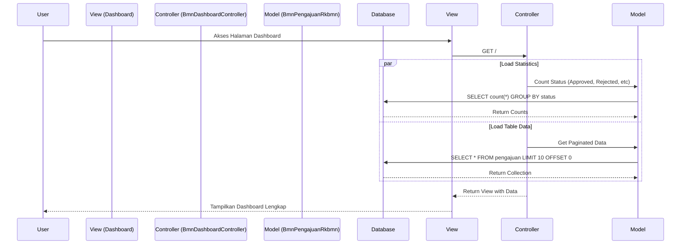
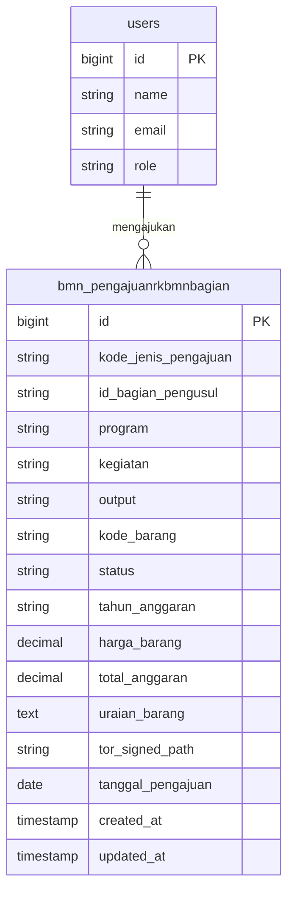

# Dokumentasi Modul RKBMN Dashboard

## 1. Use Case Diagram

```mermaid
useCaseDiagram
    actor User as "Staff BMN / Pimpinan"

    package "Modul RKBMN Dashboard" {
        usecase "Lihat Dashboard Utama" as UC1
        usecase "Lihat Statistik Ringkas" as UC2
        usecase "Filter Daftar Pengajuan" as UC3
        usecase "Lihat Detail Pengajuan" as UC4
    }

    User --> UC1
    User --> UC2
    User --> UC3
    User --> UC4
```

## 2. Activity Diagram: Monitoring Pengajuan (Swimlanes)

@startuml
|User (Staff/Pimpinan)|
start
:Akses URL Dashboard (/);

|Sistem|
:Terima Request;
:Query Data Statistik (Total, Approved, dll);
:Query Data Daftar Pengajuan (Paginated);
:Render Halaman Dashboard;

|User (Staff/Pimpinan)|
:Lihat Ringkasan KPI & Tabel;

if (Perlu Filter Data?) then (Ya)
    :Klik Panel Filter;
    :Pilih Kriteria (Bagian, Tahun, Status);
    :Klik Tombol "Terapkan";
    
    |Sistem|
    :Terima Parameter Filter;
    :Query Ulang Database dengan Kondisi WHERE;
    :Update Tampilan Tabel;
    
    |User (Staff/Pimpinan)|
else (Tidak)
    |User (Staff/Pimpinan)|
    :Analisis Data yang Tampil;
endif

stop
@enduml

## 3. Class Diagram

classDiagram
    class BmnPengajuanRkbmn {
        +Number id
        +String kode_jenis_pengajuan
        +String id_bagian_pengusul
        +String program
        +String kegiatan
        +String output
        +String kode_barang
        +String status
        +String tahun_anggaran
        +Number total_anggaran
        +scopeFilter()
        +scopePaginate()
    }

    class BmnDashboardController {
        +index(Request)
    }

    class User {
        +Number id
        +String name
        +String role
    }

    BmnDashboardController --> BmnPengajuanRkbmn : reads
    User "1" -- "*" BmnPengajuanRkbmn : views


## 4. Sequence Diagram: Load Dashboard Data



## 5. ERD (Entity Relationship Diagram)


