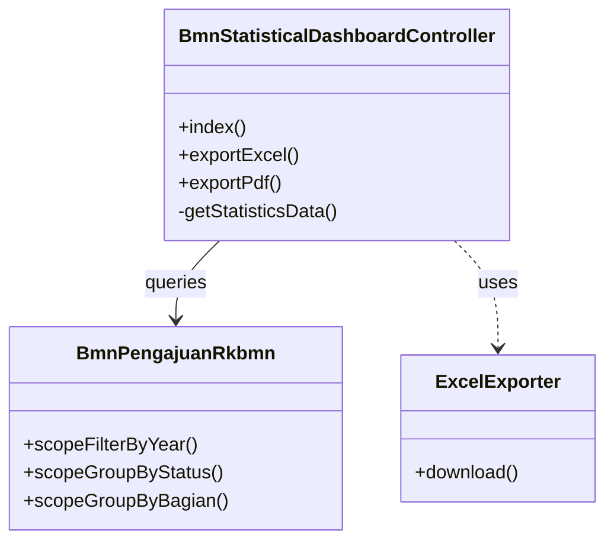
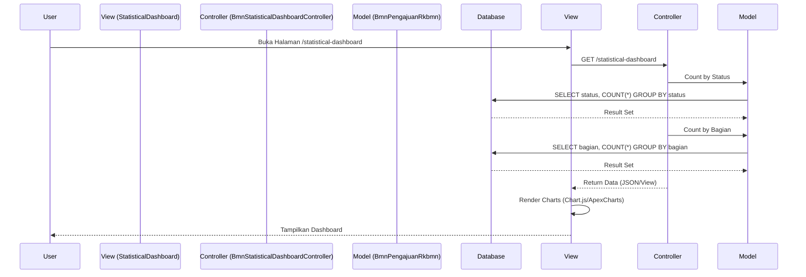
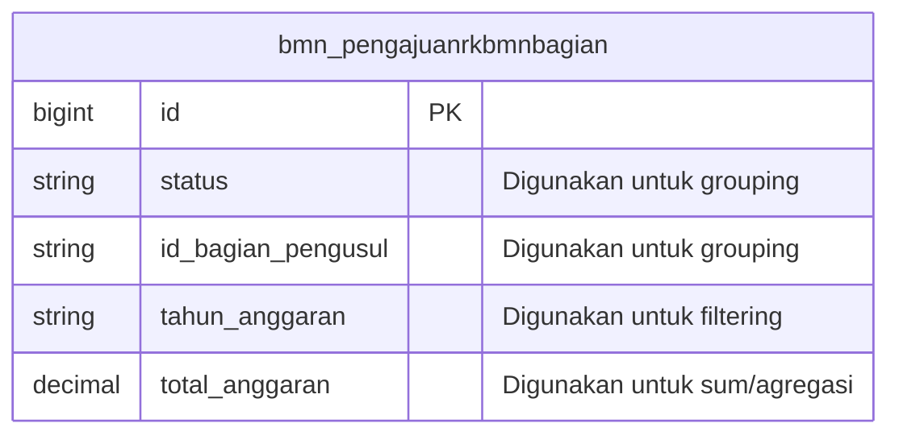

# Dokumentasi Modul RKBMN Statistical Dashboard

## 1. Use Case Diagram

```mermaid
useCaseDiagram
    actor User as "Pimpinan / Eksekutif"
    actor Staff as "Staff BMN"

    package "Modul Statistical Dashboard" {
        usecase "Lihat Dashboard Statistik" as UC1
        usecase "Analisis Distribusi Status" as UC2
        usecase "Analisis Tren per Tahun" as UC3
        usecase "Analisis Sebaran per Bagian" as UC4
        usecase "Filter Data Statistik" as UC5
    }

    User --> UC1
    User --> UC2
    User --> UC3
    User --> UC4
    User --> UC5

    Staff --> UC1
    Staff --> UC5
```

## 2. Activity Diagram: Analisis Data Statistik (Swimlanes)

```mermaid
activityDiagram
    |User (Pimpinan)|
    start
    :Akses Menu Statistik (/statistical-dashboard);
    
    |Sistem|
    :Terima Request;
    :Query Aggregat Data (Count, Group By);
    fork
        :Siapkan Data KPI;
    fork again
        :Siapkan Data Chart Status;
    fork again
        :Siapkan Data Chart Tren;
    end fork
    :Render Halaman dengan Chart.js;

    |User (Pimpinan)|
    :Lihat Visualisasi Data;
    
    if (Ubah Filter Tahun?) then (Ya)
        :Pilih Tahun di Dropdown;
        
        |Sistem|
        :Terima Parameter Tahun;
        :Query Ulang Data Sesuai Tahun;
        :Update Dataset Grafik (AJAX);
        
        |User (Pimpinan)|
        :Lihat Grafik Terupdate;
    endif
    
    stop
```

## 3. Class Diagram



## 4. Sequence Diagram: Load Dashboard Statistik



## 5. ERD (Entity Relationship Diagram)

*Catatan: Modul ini bersifat read-only (analitik) dan menggunakan tabel yang sama dengan Modul RKBMN.*


