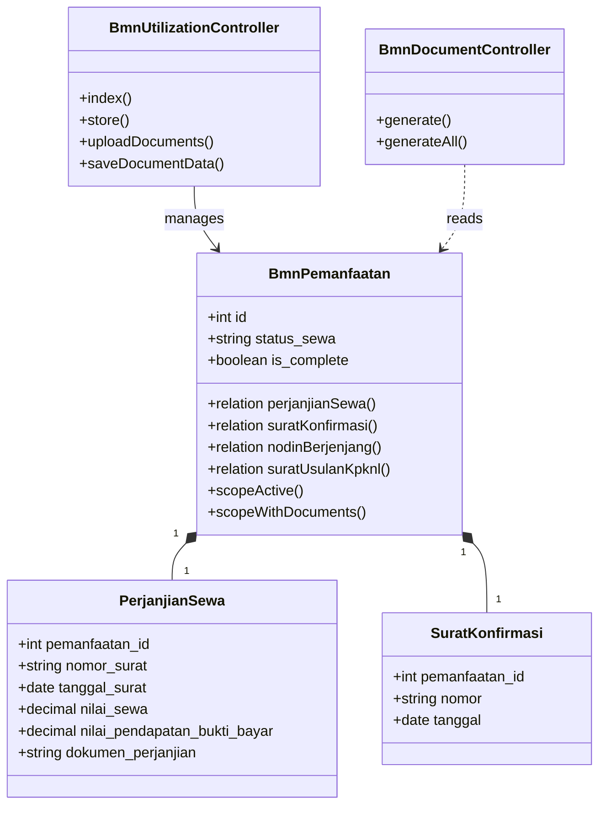
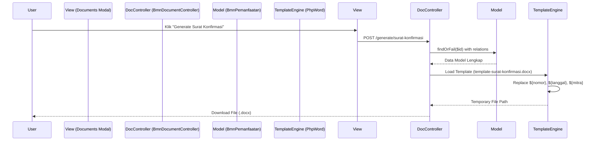
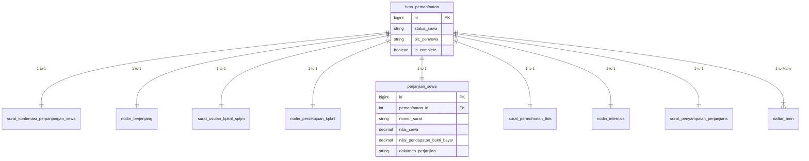

# Dokumentasi Modul Pemanfaatan BMN (Utilization Dashboard)

## 1. Use Case Diagram

```mermaid
useCaseDiagram
    actor Staff as "Staff Pengelola Aset"
    actor Kasubag as "Kepala Sub Bagian"

    package "Modul Pemanfaatan BMN" {
        usecase "Input Data Sewa Baru" as UC1
        usecase "Lengkapi Dokumen (Wizard)" as UC2
        usecase "Generate Dokumen Otomatis" as UC3
        usecase "Upload Dokumen Final" as UC4
        usecase "Monitoring Jatuh Tempo" as UC5
        usecase "Tracking Pendapatan Sewa" as UC6
    }

    Staff --> UC1
    Staff --> UC2
    Staff --> UC3
    Staff --> UC4
    Staff --> UC5
    Staff --> UC6

    Kasubag --> UC5
    Kasubag --> UC6
```

## 2. Activity Diagram: Siklus Pemanfaatan BMN (Swimlanes)

```mermaid
activityDiagram
    |Staff Pengelola|
    start
    :Input Data Awal (Mitra, PIC);
    :Klik "Simpan";
    
    |Sistem|
    :Validasi Input;
    :Create Record (Status: Draft);
    :Redirect ke Halaman Detail;
    
    |Staff Pengelola|
    :Buka Tab "Kelengkapan Dokumen";
    
    partition "Proses Dokumen (Berulang)" {
        |Staff Pengelola|
        :Pilih Jenis Dokumen (mis: Surat Konfirmasi);
        :Lengkapi Form Data Dokumen;
        :Klik "Generate Dokumen";
        
        |Sistem|
        :Ambil Template .docx;
        :Replace Placeholder dengan Data;
        :Download File ke User;
        
        |Staff Pengelola|
        :Cetak & Mintakan Tanda Tangan;
        :Scan Dokumen Final;
        :Upload File PDF;
        
        |Sistem|
        :Simpan File ke Storage;
        :Update Status Dokumen -> Lengkap;
    }

    |Sistem|
    if (Semua Dokumen Wajib Ada?) then (Ya)
        :Update Status Sewa -> Active;
        :Mulai Hitung Mundur Jatuh Tempo;
    else (Tidak)
        :Tetap Status Draft;
    endif
    
    stop
```

## 3. Class Diagram



## 4. Sequence Diagram: Generate Dokumen



## 5. ERD (Entity Relationship Diagram)


